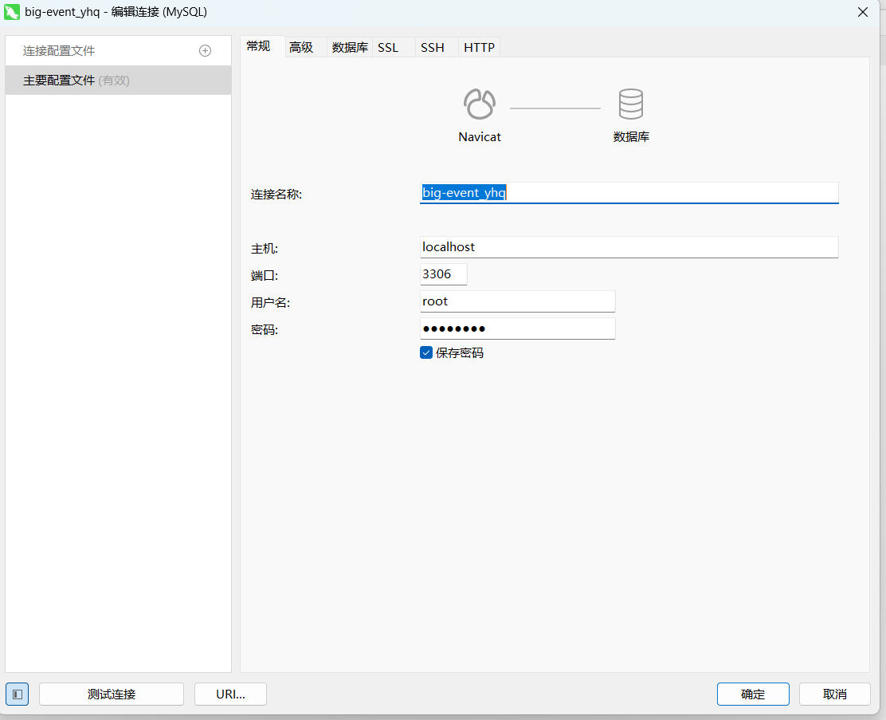
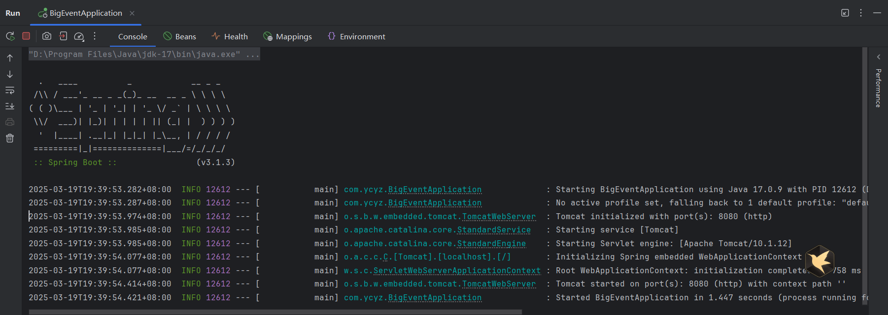
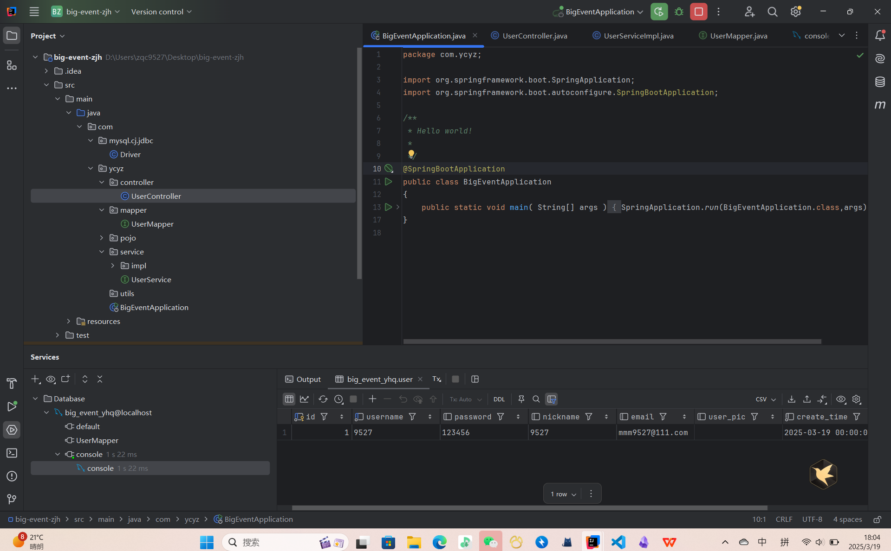
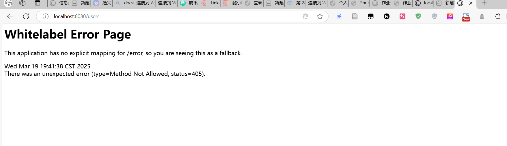

#### 3.  验证与运行

1. **启动 MySQL 数据库**
   确保已创建数据库 `big_event_db` 和表 `user`（可通过 JPA 自动生成）。
   *具体操作*：

```sql
-- 创建数据库
create database big_event_yhq;

-- 使用数据库
use big_event_yhq;

-- 用户表
create table user (
                      id int unsigned primary key auto_increment comment 'ID',
                      username varchar(20) not null unique comment '用户名',
                      password varchar(32)  comment '密码',
                      nickname varchar(10)  default '' comment '昵称',
                      email varchar(128) default '' comment '邮箱',
                      user_pic varchar(128) default '' comment '头像',
                      create_time datetime not null comment '创建时间',
                      update_time datetime not null comment '修改时间'
) comment '用户表';
```

> 额，忘了这个：连接数据库时(我用的工具时 `Navicat`：)
> 

2. **运行启动类**右键 `BigEventApplication.java` → `Run`，检查控制台是否输出启动成功日志。
   

> idea 插入数据
> 

3. **测试接口**
   使用 Postman 发送 POST 请求到 `http://localhost:8080/users`，验证用户创建功能。
   **™的傻逼玩意，到这最后一步，又看不到页面。都正确。傻逼**
   
   **于是我增加了一些东西：**
   **禁用 Spring Security 的 CSRF 保护（临时测试）**

```java
package com.ycyz.config;  
  
  
import org.springframework.context.annotation.Bean;  
import org.springframework.context.annotation.Configuration;  
import org.springframework.security.config.annotation.web.builders.HttpSecurity;  
import org.springframework.security.web.SecurityFilterChain;  
  
@Configuration  
public class SecurityConfig {  
  
    @Bean  
    public SecurityFilterChain securityFilterChain(HttpSecurity http) throws Exception {  
        http  
                .csrf(csrf -> csrf.disable())  
                .authorizeHttpRequests(auth -> auth  
                        .requestMatchers("/login", "/css/**", "/js/**").permitAll() // 放行登录页和静态资源  
                        .anyRequest().authenticated() // 其他请求需要认证  
                )  
                .formLogin(form -> form  
                        .loginPage("/login") // 指定登录页路径  
                        .loginProcessingUrl("/login") // 处理登录请求的URL  
                        .defaultSuccessUrl("/home") // 登录成功后跳转的地址  
                );  
        return http.build();  
    }  
}
```

4. **同时也添加了 Spring Security 依赖**

```xml
<!--  添加 Spring Security 依赖      -->  
<dependency>  
    <groupId>org.springframework.boot</groupId>  
    <artifactId>spring-boot-starter-security</artifactId>  
</dependency>
```

5. **添加登录页模板**
   在 `resources/templates` 目录下创建 `login.html`（需配合 Thymeleaf 或 FreeMarker）：

```html
<!DOCTYPE html>  
<html>  
<head>  
    <title>登录</title>  
</head>  
<body>  
<form action="/login" method="post">  
    <input type="text" name="username" placeholder="用户名">  
    <input type="password" name="password" placeholder="密码">  
    <button type="submit">登录</button>  
</form>  
</body>  
</html>
```

5. 最后还 **配置静态资源路径**
   确保静态资源（CSS/JS）目录正确映射：

```yml
spring:
	mvc:  
	  mvc:  
	    static-path-pattern: /static/**  
	    web:  
	      resources:  
	        static-locations: classpath:/static/
```

**最后还是：

# 当前无法使用此页面

**localhost** 重定向你太多次。

- [尝试删除 cookie](https://go.microsoft.com/fwlink/?linkid=2112473&hl=zh-CN).
  ERR_TOO_MANY_REDIRECTS
  刷新**

算了，我明天来试试！
